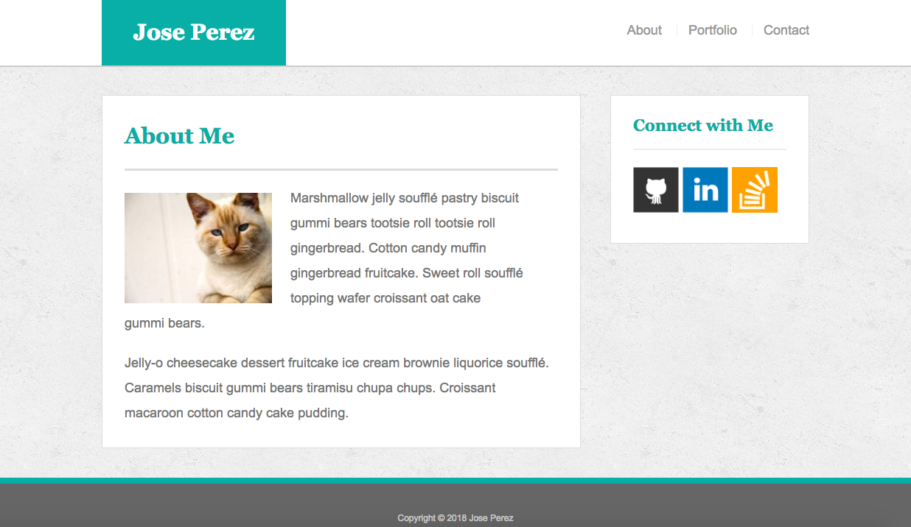
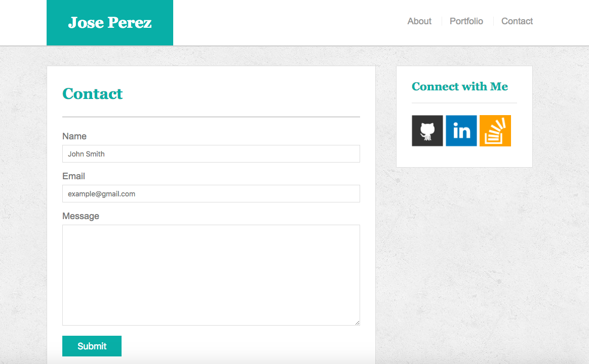

# Responsive-Portfolio

This is a responsive portfolio made with HTML CSS and the use of media query in order to be able to render a webpage for large, medium and small size screens.

## Getting Started

Download the repo to your computer and then open the index file using your chrome browser.

## Built With

* [CSS](https://www.w3schools.com/css/) - Is a language that describes the style of an HTML document. CSS describes how HTML elements should be displayed.
* [HTML](https://www.w3schools.com/css/) - Is the standard markup language for creating Web pages. HTML stands for Hyper Text Markup Language

## Author

* **Jose Perez** - *Initial work* - [Responsive Portfolio](https://github.com/jperez650/responsive-portfolio)

## License

This project is licensed under the MIT License - see the [LICENSE.md](LICENSE.md) file for details
